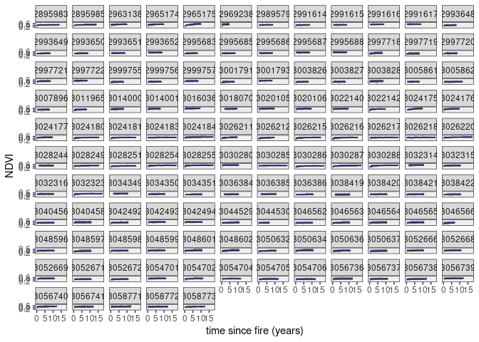

EMMA Prototype
================
true

# Model Overview

The details are given in
\[@slingsby_near-real_2020;@wilson_climatic_2015\], but in short what we
do is estimate the age of a site by calculating the years since the last
fire. We then fit a curve to model the recovery of vegetation (measured
using NDVI) as a function of it’s age. For this we use a negative
exponential curve with the following form:

")

where

is the expected NDVI for site

at time


The observed greenness

is assumed to follow a normal distribution with mean


")

An additional level models the parameters of the negative exponential
curve as a function of environmental variables. This means that sites
with similar environmental conditions should have similar recovery
curves. The full model also includes a sinusoidal term to capture
seasonal variation, but lets keep it simple here.

## Workflow

This repository was developed using the Targets framework as follows.

## Results

### Regression Coefficients

These parameters represent the relationship of the following
environmental variables to the recovery trajectory.

``` r
betas=model_results %>% 
  filter(type=="beta")


ggplot(betas,aes(y=xname, xmin=q5,x=median,xmax=q95))+
  geom_pointrange(fill="grey")+
  facet_wrap(~parameter,nrow=1)+
  geom_vline(xintercept=0,col="grey")+
  xlab(expression(beta*" (regression coefficient +/- 95% CI)"))
```

<!-- -->

## Recovery Trajectories

``` r
cells_with_long_records<-
  model_prediction %>% 
  group_by(cellID) %>% 
  summarize(n=n()) %>% 
  filter(n>100)

model_prediction %>% 
  filter(cellID%in%cells_with_long_records$cellID) %>% 
#  filter(pid %in% as.numeric(sample(levels(as.factor(posterior_summary$pid)),20))) %>% # just show a few
  ggplot(aes(x=age)) +
 geom_line(aes(y=median),colour="blue") +
  geom_line(aes(y=y_obs),colour="black",lwd=0.5,alpha=0.3) +
  geom_ribbon(aes(ymin=q5,ymax=q95),alpha=0.5)+
  facet_wrap(~cellID) +
  labs(x="time since fire (years)",y="NDVI") +
  theme_bw()
```

<!-- -->

## Spatial Predictions

Maps of spatial parameters in the model.

``` r
plot(spatial_outputs)
```

<!-- -->
